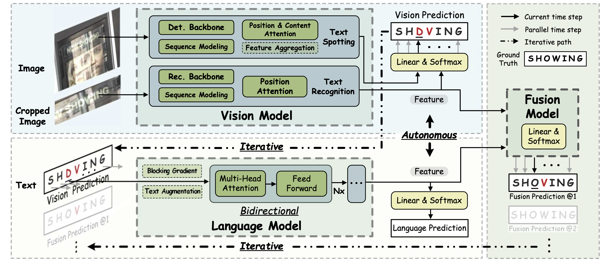

# ABINet++: Autonomous, Bidirectional and Iterative Language Modeling for Scene Text Spotting

The official code of [ABINet++](https://arxiv.org/pdf/2211.10578.pdf).




## Runtime Environment

- Use the pre-built docker image as follows:

```
$ git@github.com:FangShancheng/ABINet-PP.git
$ docker run --gpus all --rm -ti --shm-size=128g --ipc=host -v "$(pwd)"/ABINet-PP:/workspace/ABINet-PP fangshancheng/adet /bin/bash
$ cd ABINet-PP
$ python setup.py build develop
```
- Or build your custom environment from `docker/Dockerfile`

## Datasets

Training and evaluation datasets should be placed in `datasets` folder: 
```
datasets
├── syntext1
├── syntext2
├── mlt2017
├── totaltext
├── CTW1500
├── icdar2015
├── ChnSyn
├── ReCTS
├── LSVT
├── ArT
├── evaluation
│   ├── gt_ctw1500.zip
│   ├── gt_icdar2015.zip
│   └── gt_totaltext.zip
└── WikiText-103-n96.csv
```

[Here](https://github.com/aim-uofa/AdelaiDet/tree/master/datasets), a more detailed description of these datasets, and the download links can be found from [AdelaiDet](https://github.com/aim-uofa/AdelaiDet/). Additional links include  [WikiText-103-n96.csv](https://drive.google.com/file/d/1izmMP0xYrW-RbYo6C9jootFV-cHBmN0_/view), and [gt_icdar2015.zip](https://drive.google.com/file/d/1POVxA74GcK5PMxIFhd54RdNMusyIZ1Bc/view?usp=share_link) (a compatible format for this repository.)

## Pretrained Models

- English recognition:
    - [model_pretrain.pth](https://drive.google.com/file/d/1p6Pw053fFtwmOWd7Qiw3w4qYKf13-bDg/view?usp=share_link)
    - [model_ctw1500.pth](https://drive.google.com/file/d/1yKQTaXbPimKvY54K677XSB1Ps9xPE_c0/view?usp=share_link)
    - [model_icdar2015.pth](https://drive.google.com/file/d/1pZZC9vvMF1Wjz5_BPw1d64qKMm8la6L5/view?usp=share_link)
    - [model_totaltext.pth](https://drive.google.com/file/d/1hT5uZDnQAfPK2T-Ef6pBYoJj1iidqxGh/view?usp=share_link)

- Chinese recognition:
    - [model_pretrain_chn.pth](https://drive.google.com/file/d/15Qc-HyXtadxq5lfXW8vzmkhXKWi_VLgt/view?usp=share_link)
    - [model_rects.pth](https://drive.google.com/file/d/1dnqRx1Xa3Vof6VcDw3Wz4vn7eeWvGF3r/view?usp=share_link)


## Training

### English recognition

* Pretrainining:
    ```
    CUDA_VISIBLE_DEVICES=0,1,2,3 python tools/train_net.py \
        --config-file configs/ABINet/Pretrain.yaml \
        --num-gpus 4
    ```

* Finetuning on TotalText:
    ```
    CUDA_VISIBLE_DEVICES=0,1,2,3 python tools/train_net.py \
        --config-file configs/ABINet/TotalText.yaml \
        --num-gpus 4 \
        MODEL.WEIGHTS weights/abinet/model_pretrain.pth
    ```

* Finetuning on CTW1500:
    ```
    CUDA_VISIBLE_DEVICES=0,1,2,3 python tools/train_net.py \
        --config-file configs/ABINet/CTW1500.yaml \
        --num-gpus 4 \
        MODEL.WEIGHTS weights/abinet/model_pretrain.pth
    ```

* Finetuning on ICDAR2015:
    ```
    CUDA_VISIBLE_DEVICES=0,1,2,3 python tools/train_net.py \
        --config-file configs/ABINet/ICDAR2015.yaml \
        --num-gpus 4 \
        MODEL.WEIGHTS weights/abinet/model_pretrain.pth
    ```


### Chinese recognition
* Pretrainining:
    ```
    CUDA_VISIBLE_DEVICES=0,1,2,3 python tools/train_net.py \
        --config-file configs/ABINet/Pretrain-chn.yaml \
        --num-gpus 4
    ```

* Finetuning on ReCTS:
    ```
    CUDA_VISIBLE_DEVICES=0,1,2,3 python tools/train_net.py \
        --config-file configs/ABINet/ReCTS.yaml \
        --num-gpus 4 \
        MODEL.WEIGHTS weights/abinet/model_pretrain_chn.pth
    ```

## Evaluation 
* Evaluate on Totaltext:
    ```
    python tools/train_net.py \
        --config-file configs/ABINet/TotalText.yaml \
        --eval-only \
        MODEL.WEIGHTS weights/abinet/model_totaltext.pth
    ```

* Evaluate on CTW1500:
    ```
    python tools/train_net.py \
        --config-file configs/ABINet/CTW1500.yaml \
        --eval-only \
        MODEL.WEIGHTS weights/abinet/model_ctw1500.pth
    ```

* Evaluate on ICDAR2015:
    ```
    python tools/train_net.py \
        --config-file configs/ABINet/ICDAR2015.yaml \
        --eval-only \
        MODEL.WEIGHTS weights/abinet/model_icdar2015.pth
    ```

* Evaluate on ReCTS:
    ```
    python tools/train_net.py \
        --config-file configs/ABINet/ReCTS.yaml \
        --eval-only \
        MODEL.WEIGHTS weights/abinet/model_rects.pth
    ```
    For the evaluation of ReCTS, you need to submit the results using the predicted json file in the official website.

## Demo
* For TotalText
    ```
    mkdir -p output/abinet/totaltext-vis
    python demo/demo.py \
        --config-file configs/ABINet/TotalText.yaml \
        --input datasets/totaltext/test_images/* \
        --output output/abinet/totaltext-vis \
        --opts MODEL.WEIGHTS weights/abinet/model_totaltext.pth
    ```

* For CTW1500
    ```
    mkdir -p output/abinet/ctw1500-vis
    python demo/demo.py \
        --config-file configs/ABINet/CTW1500.yaml \
        --input datasets/CTW1500/ctwtest_text_image/* \
        --output output/abinet/ctw1500-vis \
        --opts MODEL.WEIGHTS weights/abinet/model_ctw1500.pth
    ```

* For ICDAR2015
    ```
    mkdir -p output/abinet/icdar2015-vis
    python demo/demo.py \
        --config-file configs/ABINet/ICDAR2015.yaml \
        --input datasets/icdar2015/test_images/* \
        --output output/abinet/icdar2015-vis \
        --opts MODEL.WEIGHTS weights/abinet/model_icdar2015.pth
    ```

* For ReCTS (Chinese)
    ```
    wget https://drive.google.com/file/d/1dcR__ZgV_JOfpp8Vde4FR3bSR-QnrHVo/view?usp=sharing -O simsun.ttc
    wget https://drive.google.com/file/d/1wqkX2VAy48yte19q1Yn5IVjdMVpLzYVo/view?usp=sharing -O chn_cls_list
    mkdir -p output/abinet/rects-vis
    python demo/demo.py \
        --config-file configs/ABINet/ReCTS.yaml \
        --input datasets/ReCTS/ReCTS_test_images/* \
        --output output/abinet/rects-vis \
        --opts MODEL.WEIGHTS weights/abinet/model_rects.pth
    ```

## BibTeX

```BibTeX

@ARTICLE{9960802,  
    author={Fang, Shancheng and Mao, Zhendong and Xie, Hongtao and Wang, Yuxin and Yan, Chenggang and Zhang, Yongdong},  
    journal={IEEE Transactions on Pattern Analysis and Machine Intelligence},   
    title={ABINet++: Autonomous, Bidirectional and Iterative Language Modeling for Scene Text Spotting},   
    year={2022},  
    volume={},  
    number={},  
    pages={1-18},  
    doi={10.1109/TPAMI.2022.3223908}
}

@inproceedings{fang2021read,
    title={Read like humans: Autonomous, bidirectional and iterative language modeling for scene text recognition},
    author={Fang, Shancheng and Xie, Hongtao and Wang, Yuxin and Mao, Zhendong and Zhang, Yongdong},
    booktitle={Proceedings of the IEEE/CVF Conference on Computer Vision and Pattern Recognition},
    pages={7098--7107},
    year={2021}
}
```


## License

This project is only free for academic research purposes.

Feel free to contact fangsc@ustc.edu.cn if you have any questions.